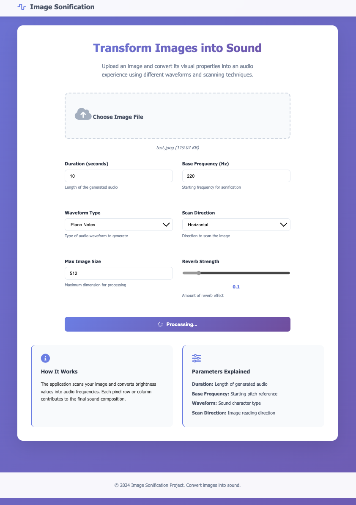

# Image Sonification Web Application

A web application that converts images into sound through sonification. Transform visual information into audio experiences using different waveforms and scanning techniques.


## 🌟 Features

- **Multiple Waveforms**: Sine, Square, Sawtooth, Triangle, and Piano notes
- **Flexible Scanning**: Horizontal and vertical image scanning
- **Audio Effects**: Configurable reverb strength
- **High-Quality Output**: 44.1kHz, 16-bit WAV audio
- **Visual Feedback**: Scan path and waveform visualizations
- **Responsive Design**: Works on desktop and mobile devices
- **Real-time Processing**: Fast image processing and audio generation

## 🚀 Quick Start

### Prerequisites

- Python 3.8 or higher
- pip (Python package manager)

### Installation

1. **Clone the repository**
   ```bash
   git clone https://github.com/ahrbadr/Image-Sonification.git
   cd image-sonification
   ```

2. **Create a virtual environment** (recommended)
   ```bash
   python -m venv venv
   source venv/bin/activate  # On Windows: venv\Scripts\activate
   ```

3. **Install dependencies**
   ```bash
   pip install -r requirements.txt
   ```

4. **Run the application**
   ```bash
   python run.py
   ```

5. **Access the application**
   Open your browser and navigate to `http://localhost:5001`

## 📖 Usage

1. **Upload an image** (PNG, JPG, JPEG, BMP, TIFF)
2. **Adjust parameters**:
   - **Duration**: Length of generated audio (0.1-60 seconds)
   - **Base Frequency**: Starting pitch (20-20000 Hz)
   - **Waveform**: Type of sound wave
   - **Scan Direction**: Horizontal or vertical image reading
   - **Max Image Size**: Processing dimension limit
   - **Reverb Strength**: Amount of reverb effect

3. **Generate sonification**: Click "Generate Sonification"
4. **Listen and download**: Play the generated audio and download the WAV file

## 🛠️ Technical Details

### Audio Generation

- **Sample Rate**: 44.1 kHz (CD quality)
- **Bit Depth**: 16-bit
- **Format**: WAV (uncompressed)
- **Waveforms**: 
  - Sine: Smooth, pure tones
  - Square: Rich, harmonic content
  - Sawtooth: Bright, buzzing sounds
  - Triangle: Mellow, flute-like tones
  - Piano: Discrete notes with ADSR envelope

### Image Processing

- **Grayscale Conversion**: Images are converted to luminance values
- **Adaptive Resizing**: Maintains aspect ratio while respecting size limits
- **Brightness Mapping**: Pixel brightness controls frequency and amplitude

### Algorithms

- **Frequency Mapping**: Linear mapping of brightness to frequency range
- **Piano Note Synthesis**: Physical modeling with harmonics and envelope
- **Reverb Effect**: Convolution with exponentially decaying noise

## 📁 Project Structure

```
image-sonification/
├── app.py                 # Main Flask application
├── run.py                # Application runner
├── config.py             # Configuration settings
├── requirements.txt      # Python dependencies
├── README.md            # This file
├── templates/           # HTML templates
│   ├── base.html       # Base template
│   ├── index.html      # Main page
│   └── result.html     # Results page
├── static/             # Static assets
│   ├── css/
│   │   └── style.css   # Stylesheets
│   └── js/
│       └── script.js   # JavaScript
└── uploads/            # Uploaded images (auto-created)
```

## 🔧 Configuration

Edit `config.py` to customize:

- **Upload limits**: Maximum file size
- **Audio settings**: Default sample rate, duration
- **Security**: Secret key for sessions
- **Performance**: Processing limits

## 🐛 Troubleshooting

### Common Issues

1. **"Module not found" errors**
   - Ensure all dependencies are installed: `pip install -r requirements.txt`

2. **Audio generation fails**
   - Check image format and size
   - Verify parameter ranges are within limits

3. **Performance issues**
   - Reduce maximum image size
   - Use smaller images for faster processing

### System Requirements

- **RAM**: Minimum 2GB, 4GB recommended
- **Storage**: 100MB free space
- **Browser**: Modern browser with audio support


## 📄 License

This project is completely free to use, modify, and distribute. No restrictions apply.

## 🙏 Acknowledgments

- Flask community for the excellent web framework
- NumPy and SciPy for scientific computing
- Matplotlib for visualization capabilities
- OpenCV for image processing

---

**Enjoy transforming your images into sound! 🎵**
```

## Installation and Setup Instructions

### Quick Setup Script (setup.sh)

```bash
#!/bin/bash
echo "Setting up Image Sonification Application..."

# Create virtual environment
python3 -m venv venv
source venv/bin/activate

# Install dependencies
pip install --upgrade pip
pip install -r requirements.txt

# Create necessary directories
mkdir -p uploads static

echo "Setup complete! Run the application with: python run.py"
```

### Windows Setup Script (setup.bat)

```batch
@echo off
echo Setting up Image Sonification Application...

python -m venv venv
call venv\Scripts\activate.bat

pip install --upgrade pip
pip install -r requirements.txt

mkdir uploads 2>nul
mkdir static 2>nul

echo Setup complete! Run the application with: python run.py
pause
```
